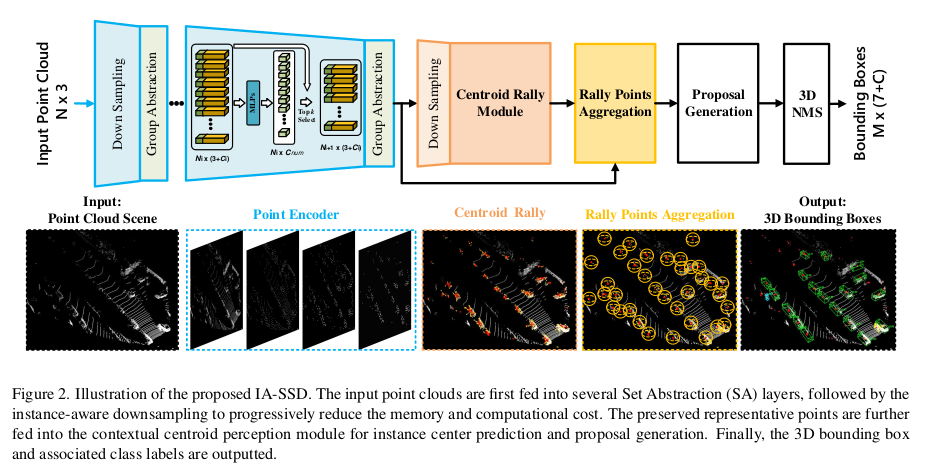
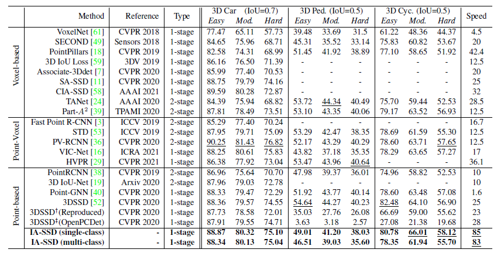
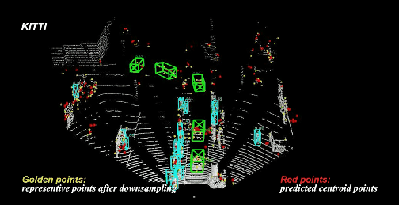
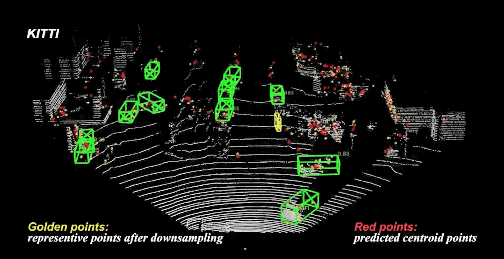
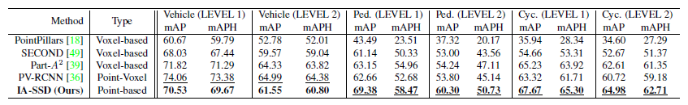
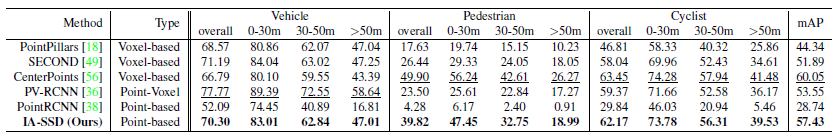

[](https://arxiv.org/abs/2203.11139)
[](https://github.com/yifanzhang713/IA-SSD)


# Not All Points Are Equal: Learning Highly Efficient Point-based Detectors for 3D LiDAR Point Clouds (CVPR 2022, Oral)

This is the official implementation of ***IA-SSD*** (CVPR 2022), a simple and highly efficient point-based detector for 3D LiDAR point clouds. For more details, please refer to:

**Not All Points Are Equal: Learning Highly Efficient Point-based Detectors for 3D LiDAR Point Clouds** <br />
Yifan Zhang, [Qingyong Hu*](https://qingyonghu.github.io/), Guoquan Xu, Yanxin Ma, Jianwei Wan, [Yulan Guo](http://yulanguo.me/)<br />

**[[Paper](https://arxiv.org/abs/2203.11139)] [[Video](https://www.youtube.com/watch?v=3jP2o9KXunA)]** <br />

<p align="center">  </p>


## Getting Started
### Installation

a. Clone this repository
```shell
git clone https://github.com/yifanzhang713/IA-SSD.git && cd IA-SSD
```
b. Configure the environment

We have tested this project with the following environments:
* Ubuntu18.04/20.04
* Python = 3.7
* PyTorch = 1.1
* CUDA = 10.0
* CMake >= 3.13
* spconv = 1.0 
    ```shell
    # install spconv=1.0 library
    git clone https://github.com/yifanzhang713/spconv1.0.git
    cd spconv1.0
    sudo apt-get install libboostall-dev
    python setup.py bdist_wheel
    pip install ./dist/spconv-1.0*   # wheel file name may be different
    cd ..
    ```

*You are encouraged to try to install higher versions above, please refer to the [official github repository](https://github.com/open-mmlab/OpenPCDet) for more information. **Note that the maximum number of parallel frames during inference might be slightly decrease due to the larger initial GPU memory footprint with updated `Pytorch` version.**

c. Install `pcdet` toolbox.
```shell
pip install -r requirements.txt
python setup.py develop
```

d. Prepare the datasets. 

Download the official KITTI with [road planes](https://drive.google.com/file/d/1d5mq0RXRnvHPVeKx6Q612z0YRO1t2wAp/view?usp=sharing) and Waymo datasets, then organize the unzipped files as follows:
```
IA-SSD
├── data
│   ├── kitti
│   │   ├── ImageSets
│   │   ├── training
│   │   │   ├──calib & velodyne & label_2 & image_2 & (optional: planes)
│   │   ├── testing
│   │   ├── calib & velodyne & image_2
│   ├── waymo
│   │   │── ImageSets
│   │   │── raw_data
│   │   │   │── segment-xxxxxxxx.tfrecord
|   |   |   |── ...
|   |   |── waymo_processed_data_v0_5_0
│   │   │   │── segment-xxxxxxxx/
|   |   |   |── ...
│   │   │── waymo_processed_data_v0_5_0_gt_database_train_sampled_1/
│   │   │── waymo_processed_data_v0_5_0_waymo_dbinfos_train_sampled_1.pkl
│   │   │── waymo_processed_data_v0_5_0_gt_database_train_sampled_1_global.npy (optional)
│   │   │── waymo_processed_data_v0_5_0_infos_train.pkl (optional)
│   │   │── waymo_processed_data_v0_5_0_infos_val.pkl (optional)
├── pcdet
├── tools
```
Generate the data infos by running the following commands:
```python 
# KITTI dataset
python -m pcdet.datasets.kitti.kitti_dataset create_kitti_infos tools/cfgs/dataset_configs/kitti_dataset.yaml

# Waymo dataset
python -m pcdet.datasets.waymo.waymo_dataset --func create_waymo_infos \
    --cfg_file tools/cfgs/dataset_configs/waymo_dataset.yaml
```


### Quick Inference
We provide the pre-trained weight file so you can just run with that:
```shell
cd tools 
# To achieve fully GPU memory footprint (NVIDIA RTX2080Ti, 11GB).
python test.py --cfg_file cfgs/kitti_models/IA-SSD.yaml --batch_size 100 \
    --ckpt IA-SSD.pth --set MODEL.POST_PROCESSING.RECALL_MODE 'speed'

# To reduce the pressure on the CPU during preprocessing, a suitable batchsize is recommended, e.g. 16. (Over 5 batches per second on RTX2080Ti)
python test.py --cfg_file cfgs/kitti_models/IA-SSD.yaml --batch_size 16 \
    --ckpt IA-SSD.pth --set MODEL.POST_PROCESSING.RECALL_MODE 'speed' 
```
* Then detailed inference results can be found [here](docs/imgs/quick_inference.txt).


### Training
The configuration files are in ```tools/cfgs/kitti_models/IA-SSD.yaml``` and ```tools/cfgs/waymo_models/IA-SSD.yaml```, and the training scripts are in ```tools/scripts```.

Train with single or multiple GPUs: (e.g., KITTI dataset)
```shell
python train.py --cfg_file cfgs/kitti_models/IA-SSD.yaml

# or 

sh scripts/dist_train.sh ${NUM_GPUS} --cfg_file cfgs/kitti_models/IA-SSD.yaml
```


### Evaluation

Evaluate with single or multiple GPUs: (e.g., KITTI dataset)
```shell
python test.py --cfg_file cfgs/kitti_models/IA-SSD.yaml  --batch_size ${BATCH_SIZE} --ckpt ${PTH_FILE}

# or

sh scripts/dist_test.sh ${NUM_GPUS} \
    --cfg_file cfgs/kitti_models/IA-SSD.yaml --batch_size ${BATCH_SIZE} --ckpt ${PTH_FILE}
```

### Experimental results

#### KITTI dataset

Quantitative results of different approaches on KITTI dataset (*test* set):
<p align="center">  </p>

Qualitative results of our IA-SSD on KITTI dataset: 
|     |    |
| -------------------------------- | ------------------------------- |
|     |    |


Quantitative results of different approaches on Waymo dataset (*validation* set):
<p align="center">  </p>

Qualitative results of our IA-SSD on Waymo dataset:

|     |    |
| -------------------------------- | ------------------------------- |
|     |    |


Quantitative results of different approaches on ONCE dataset (*validation* set):
<p align="center">  </p>

Qualitative result of our IA-SSD on ONCE dataset:
<p align="center">  </p>


## Citation 
If you find this project useful in your research, please consider citing:

```
@inproceedings{zhang2022not,
  title={Not All Points Are Equal: Learning Highly Efficient Point-based Detectors for 3D LiDAR Point Clouds},
  author={Zhang, Yifan and Hu, Qingyong and Xu, Guoquan and Ma, Yanxin and Wan, Jianwei and Guo, Yulan},
  booktitle={Proceedings of the IEEE Conference on Computer Vision and Pattern Recognition},
  year={2022}
}
```

## Acknowledgement
-  This work is built upon the `OpenPCDet` (version `0.5`), an open source toolbox for LiDAR-based 3D scene perception. Please refer to the [official github repository](https://github.com/open-mmlab/OpenPCDet) for more information.

-  Parts of our Code refer to <a href="https://github.com/qiqihaer/3DSSD-pytorch-openPCDet">3DSSD-pytorch-openPCDet</a> library and the the recent work <a href="https://github.com/blakechen97/SASA">SASA</a>.


## License

This project is released under the [Apache 2.0 license](LICENSE).


## Related Repos
1. [RandLA-Net: Efficient Semantic Segmentation of Large-Scale Point Clouds](https://github.com/QingyongHu/RandLA-Net) 
2. [SensatUrban: Learning Semantics from Urban-Scale Photogrammetric Point Clouds](https://github.com/QingyongHu/SpinNet) 
3. [3D-BoNet: Learning Object Bounding Boxes for 3D Instance Segmentation on Point Clouds](https://github.com/Yang7879/3D-BoNet) 
4. [SpinNet: Learning a General Surface Descriptor for 3D Point Cloud Registration](https://github.com/QingyongHu/SpinNet) 
5. [SQN: Weakly-Supervised Semantic Segmentation of Large-Scale 3D Point Clouds with 1000x Fewer Labels](https://github.com/QingyongHu/SQN) 
6. [SoTA-Point-Cloud: Deep Learning for 3D Point Clouds: A Survey](https://github.com/QingyongHu/SoTA-Point-Cloud) 
